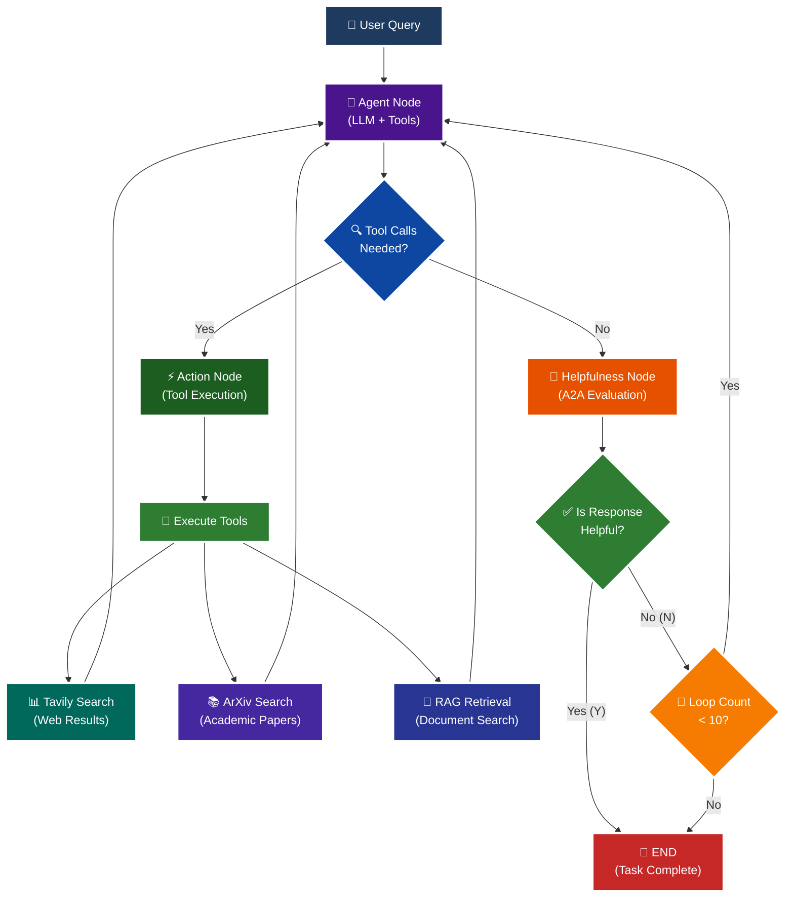

<p align = "center" draggable="false" >
</p>

## <h1 align="center" id="heading">Session 15: Build & Serve an A2A Endpoint for Our LangGraph Agent</h1>

| 📰 Session Sheet | ⏺️ Recording     | 🖼️ Slides        | 👨‍💻 Repo         | 📝 Homework      | 📁 Feedback       |
|:-----------------|:-----------------|:-----------------|:-----------------|:-----------------|:-----------------|
| [Session 15: Agent2Agent Protocol & Agent Ops](https://www.notion.so/Session-15-Agent2Agent-Protocol-Agent-Ops-26acd547af3d807c9fcdcc8864a6608a) |[Recording!](https://us02web.zoom.us/rec/share/Iz9bYK2w3p4FrtspRgMW4JKKxAlBVy1lKA-Xi99MzL7sqiLyHHVyAmyAq203HlqI.FvkopZBYLuYyCCu0) (Lyk+4@LS) | [Session 15 Slides](https://www.canva.com/design/DAG3HTQCrYs/Q2Oil7xFzz4DFEgmXdSGgg/edit?utm_content=DAG3HTQCrYs&utm_campaign=designshare&utm_medium=link2&utm_source=sharebutton) | You are here! | [Session 15 Assignment: A2A](https://forms.gle/fKTXjMJZHLReENUW9) | [AIE8 Feedback 9/16](https://forms.gle/LhGHKygFT3bfLqfS9)

# A2A Protocol Implementation with LangGraph

This session focuses on implementing the **A2A (Agent-to-Agent) Protocol** using LangGraph, featuring intelligent helpfulness evaluation and multi-turn conversation capabilities.

## 🎯 Learning Objectives

By the end of this session, you'll understand:

- **🔄 A2A Protocol**: How agents communicate and evaluate response quality

## 🧠 A2A Protocol with Helpfulness Loop

The core learning focus is this intelligent evaluation cycle:



# Build 🏗️

Complete the following tasks to understand A2A protocol implementation:

## 🚀 Quick Start

```bash
# Setup and run
./quickstart.sh
```

```bash
# Start LangGraph server
uv run python -m app
```

```bash
# Test the A2A Serer
uv run python app/test_client.py
```

### 🏗️ Activity #1:

Build a LangGraph Graph to "use" your application.

Do this by creating a Simple Agent that can make API calls to the 🤖Agent Node above through the A2A protocol. 

### ❓ Question #1:

What are the core components of an `AgentCard`?

##### ✅ Answer:

The core components of an `AgentCard` are:

1. **name**: The display name of the agent (e.g., "General Purpose Agent")
2. **description**: A detailed description of the agent's purpose and capabilities
3. **url**: The base URL where the agent server is hosted
4. **version**: Version identifier for the agent (e.g., "1.0.0")
5. **default_input_modes**: List of supported content types for input (e.g., ['text', 'text/plain'])
6. **default_output_modes**: List of supported content types for output
7. **capabilities**: An `AgentCapabilities` object defining features like:
   - `streaming`: Whether the agent supports streaming responses
   - `push_notifications`: Whether the agent supports push notifications
8. **skills**: A list of `AgentSkill` objects, each containing:
   - `id`: Unique identifier for the skill
   - `name`: Display name of the skill
   - `description`: What the skill does
   - `tags`: Keywords describing the skill
   - `examples`: Example use cases for the skill

These components allow clients to discover and understand an agent's capabilities before interacting with it through the A2A protocol.

### ❓ Question #2:

Why is A2A (and other such protocols) important in your own words?

##### ✅ Answer:

A2A (Agent-to-Agent) and similar protocols are critically important for several key reasons:

1. **Standardization & Interoperability**: A2A provides a standardized way for different AI agents to communicate, regardless of their underlying implementation, framework, or hosting infrastructure. This is like HTTP for the web - it enables diverse systems to work together seamlessly.

2. **Composable AI Systems**: With A2A, we can build complex AI systems by composing multiple specialized agents. One agent might excel at web search, another at document analysis, and another at mathematical reasoning. A2A allows them to work together as a unified system.

3. **Scalability & Distribution**: Rather than building monolithic agents that try to do everything, A2A enables distributed agent architectures where each agent can be independently developed, deployed, and scaled based on demand.

4. **Quality Assurance**: The helpfulness evaluation loop in A2A ensures that agent responses meet quality standards before being returned to users. This creates a feedback mechanism that can improve overall system reliability.

5. **Discovery & Capabilities**: Through AgentCards, clients can discover what agents are available and what they can do before making requests. This enables dynamic routing of requests to the most appropriate agent.

6. **Future-Proofing**: As the AI landscape evolves, having standardized protocols ensures that new agents can integrate with existing systems without requiring complete rewrites or custom integrations.

A2A essentially creates an "internet of agents" where specialized AI services can discover, communicate with, and leverage each other's capabilities in a standardized, reliable way.

<details>
<summary>🚧 Advanced Build 🚧 (OPTIONAL - <i>open this section for the requirements</i>)</summary>

Use a different Agent Framework to **test** your application.

Do this by creating a Simple Agent that acts as different personas with different goals and have that Agent use your Agent through A2A. 

Example:

"You are an expert in Machine Learning, and you want to learn about what makes Kimi K2 so incredible. You are not satisfied with surface level answers, and you wish to have sources you can read to verify information."
</details>

## 📁 Implementation Details

For detailed technical documentation, file structure, and implementation guides, see:

**➡️ [app/README.md](./app/README.md)**

This contains:
- Complete file structure breakdown
- Technical implementation details
- Tool configuration guides
- Troubleshooting instructions
- Advanced customization options

# Ship 🚢

- Short demo showing running Client

## 🎬 Demo: Running the Client Agent

Here's how to run a short demo showing the client agent in action:

### Prerequisites
1. **Environment Setup**: Run the quickstart to set up dependencies
   ```bash
   ./quickstart.sh
   ```

2. **Start the A2A Server**: In one terminal, start the server
   ```bash
   uv run python -m app
   ```
   The server will start on `http://localhost:10000`

### Option 1: Quick Demo Script 
```bash
# In a second terminal, run the automated demo
./run_demo.sh
```

### Option 2: Manual Demo
```bash
# In a second terminal, run the demo client
uv run python demo_client.py
```

### Demo Features

The demo showcases:

1. **Automated Demo Queries**: 
   - Web search: "What are the latest developments in artificial intelligence?"
   - Academic search: "Find me recent papers on transformer architectures"  
   - RAG search: "What information is available in the loaded documents?"

2. **Interactive Mode**: Ask your own questions and see real-time A2A communication

3. **Real-time Monitoring**: Shows response times and A2A protocol communication

### Expected Output

```
🤖 Simple Client Agent - A2A Protocol Demo
============================================================
📤 Demo Query 1/3
Description: Web search query to test Tavily integration
Query: What are the latest developments in artificial intelligence?
--------------------------------------------------------------------------------
📥 A2A Server Response:
A2A Server Response: [Detailed AI developments from web search]
⏱️  Response time: 8.45 seconds
```

The demo proves the A2A protocol works by showing:
- ✅ Agent card discovery and connection
- ✅ Message formatting and transmission  
- ✅ Tool execution (web search, arxiv, RAG)
- ✅ Helpfulness evaluation loop
- ✅ Structured response handling

### Troubleshooting Demo Issues

**Server Connection Error**:
```bash
# Check if server is running
curl http://localhost:10000/.well-known/agent_card

# If not running, start it:
uv run python -m app
```

**Import Errors**:
```bash
# Make sure dependencies are installed
uv sync

# Check environment configuration
uv run python check_env.py
```

**API Key Issues**:
- Ensure `OPENAI_API_KEY` is set in your `.env` file
- Optionally set `TAVILY_API_KEY` for web search functionality

# Share 🚀

- Explain the A2A protocol implementation
- Share 3 lessons learned about agent evaluation
- Discuss 3 lessons not learned (areas for improvement)

# Submitting Your Homework

## Main Homework Assignment

Follow these steps to prepare and submit your homework assignment:
1. Create a branch of your `AIE8` repo to track your changes. Example command: `git checkout -b s15-assignment`
2. Complete the activity above
3. Answer the questions above _in-line in this README.md file_
4. Record a Loom video reviewing the Simple Agent you built for Activity #1 and the results.
5. Commit, and push your changes to your `origin` repository. _NOTE: Do not merge it into your main branch._
6. Make sure to include all of the following on your Homework Submission Form:
    + The GitHub URL to the `15_A2A_LANGGRAPH` folder _on your assignment branch (not main)_
    + The URL to your Loom Video
    + Your Three Lessons Learned/Not Yet Learned
    + The URLs to any social media posts (LinkedIn, X, Discord, etc.) ⬅️ _easy Extra Credit points!_

### OPTIONAL: 🚧 Advanced Build Assignment 🚧
<details>
  <summary>(<i>Open this section for the submission instructions.</i>)</summary>

Follow these steps to prepare and submit your homework assignment:
1. Create a branch of your `AIE8` repo to track your changes. Example command: `git checkout -b s015-assignment`
2. Complete the requirements for the Advanced Build
3. Record a Loom video reviewing the agent you built and demostrating in action
4. Commit, and push your changes to your `origin` repository. _NOTE: Do not merge it into your main branch._
5. Make sure to include all of the following on your Homework Submission Form:
    + The GitHub URL to the `15_A2A_LANGGRAPH` folder _on your assignment branch (not main)_
    + The URL to your Loom Video
    + Your Three Lessons Learned/Not Yet Learned
    + The URLs to any social media posts (LinkedIn, X, Discord, etc.) ⬅️ _easy Extra Credit points!_
</details>
